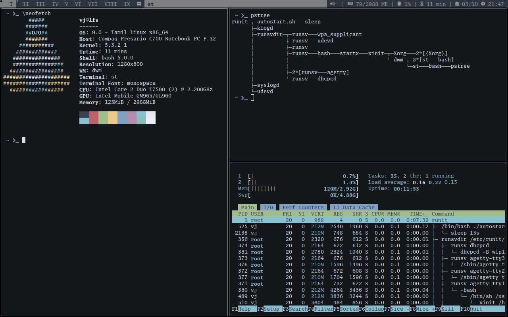
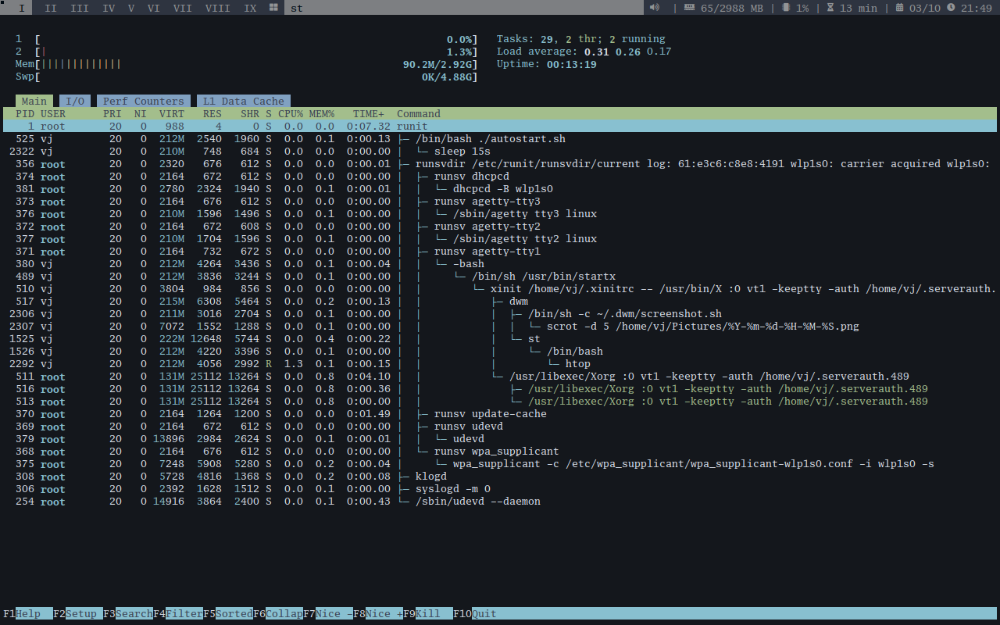

# Information

Linux kernel 5.3.2 + runit + xorg + dwm

All the scripts are copied from  https://github.com/emmett1/lfs-scripts
I just updated to latest version of all the packages/kernel 5.3.2 and few fixes and modifications.

1. I did use runit as init system (no sysvint and systemd) and modify the scripts for runit.

Used Solus as hostsystem so please install the base packages using below command

2. sudo eopkg install -c system.devel
3. warning
  
  mount your partition /mnt/lfs before executing any script else you may break your system
  add this in your .bashrc 
    export LFS=/mnt/lfs
    and check echo $LFS
4. everything happens inside this directory (work,source and db file) - $LFS/var/lib/pkg/ 
5. for reference http://www.linuxfromscratch.org/lfs/view/development/index.html    

6. Screenshot

Observations

1. Perl package gives error so install latest perl in hostsystem and run the script.
2. If you need to reinstall any package or workaround then remove the package entry in db file.
    location ==> $LFS/var/lib/pkg/db 
3. if you need any additional driver you need to reconfigure the kernel...you can find those details in
   google :)
4. for installing gnome,xfce,etc etc.....please refer to this website http://www.linuxfromscratch.org/blfs

start installing from 01-* script and script 05-* is optional.

# lfs-scripts

This repo contain scripts to automate LFS build + livecd.

#### Requirements

* sudo
* run the version-check.sh file first and it should pass all the test
* squashfs-tools & libisoburn (optional to create the livecd iso)

#### scripts

* 01-toolchain
  - toolchain script to build base lfs (required)
  - this script need run as regular user
  - this script resume-able, just re-run the script to continue where you left
  
* 02-lfs-base
  - script to build base lfs system
  - this script need run as root
  - each package has its own build script
  - you can create your own package build scripts using template (in lfs/pkgscripts dir)
  - extra packages is added into this base lfs, eg:
    - linux kernel
    - wget
    - dhcpcd
    - wpa_supplicant
    - mkinitramfs (taken from Venom Linux, livecd support)
  - this script resume-able, just re-run the script to continue where you left
    
* 03-mklfsiso
  - script to build lfs livecd iso
  - this script need run as root
  
* version-check.sh
  - script to check utilities requirements to build lfs

#### Note

* If you wanna build lfs to run in your machine/virtual you need to create partition for this lfs system and mount to /mnt/lfs directory.
* If you just wanna create the livecd iso, you can straight run these script without mount partition for lfs.
* By default this script build the lfs system in /mnt/lfs directory, so make sure you spare this directory for it.
* If you wanna include extra package to base system/livecd, create build script into lfs/pkgscripts directory using existing template, edit 02-lfs-base script, add your custom package name to 'EXTRA_PKGS' and re-run the script.
* By default all package built using '-O2 -march=x86-64 -pipe' for CFLAGS and CXXFLAGS, all cores for 'MAKEFLAGS', edit lfs/pkg.conf if you wanna change it.
